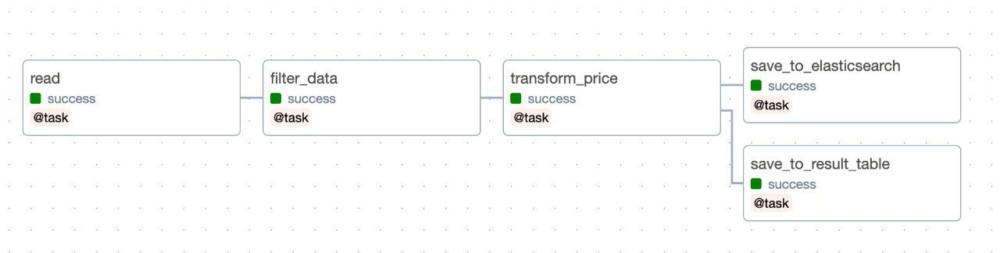
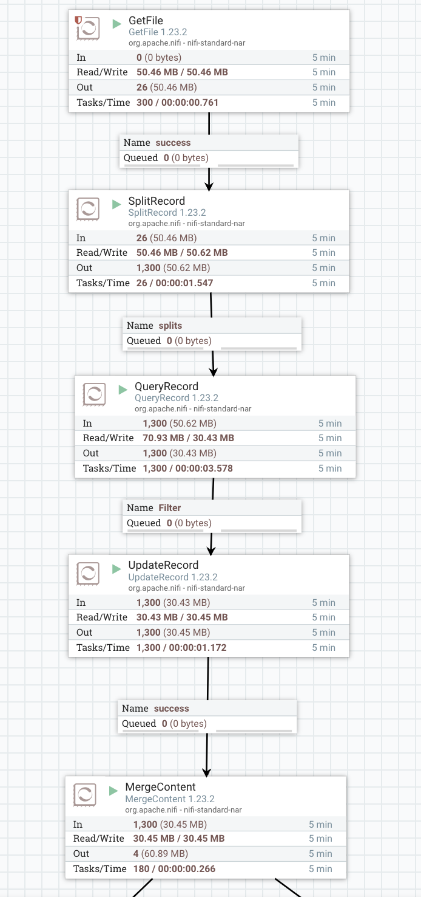
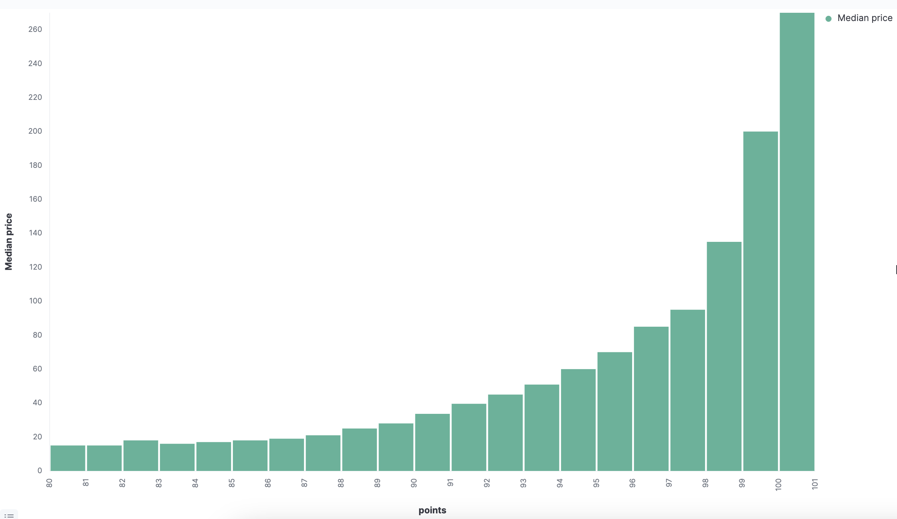
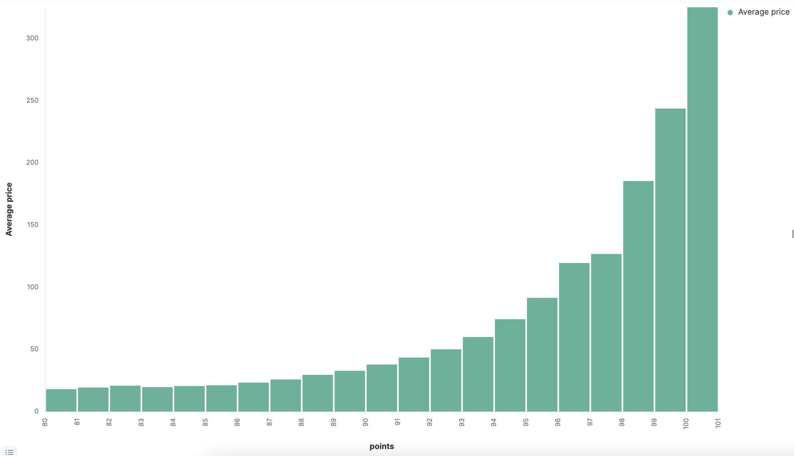
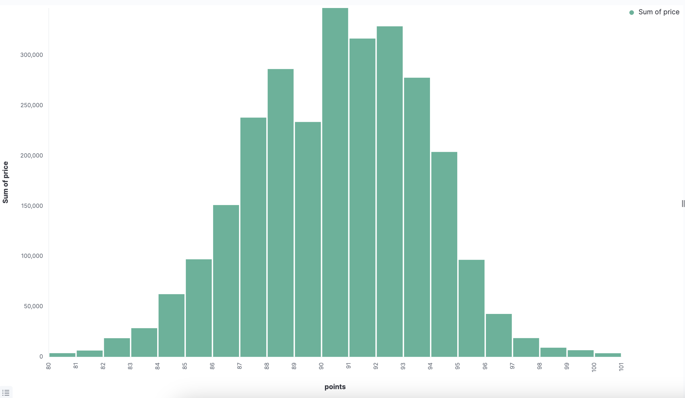

# Airflow

Реализованы описанные в задании шаги с использованием @task

# Nifi

Построен пайплайн с использованем процессоров, описанных в задании
# Kibana

Построены три гистограммы (average price, median price, sum of price)